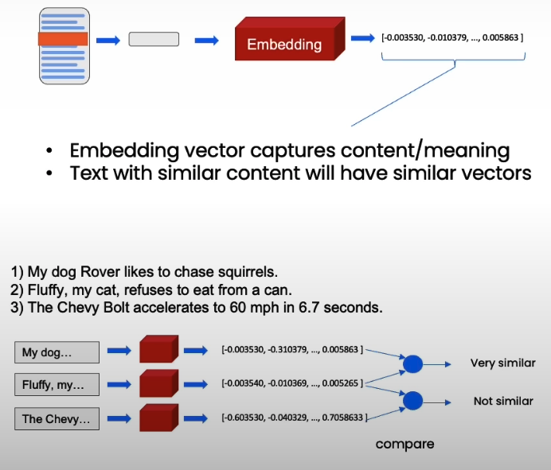
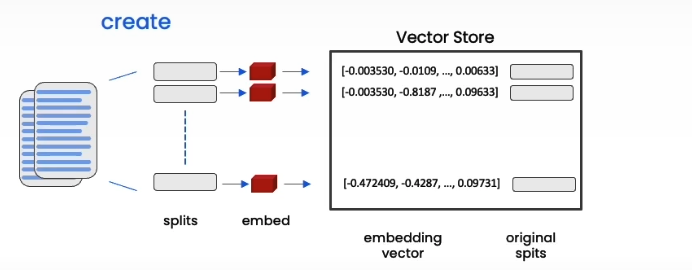
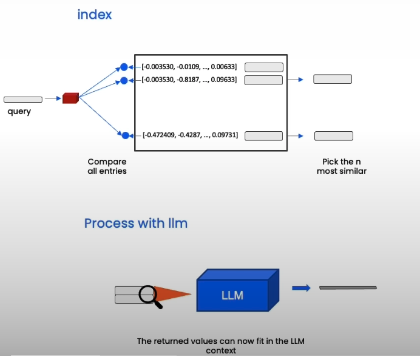

# Embeddings & Vector Stores

## Embeddings

- Embedding vector captures content/meaning
- Text with similar content will have similar vectors

## Vector Stores

 Vector Store creating from embedded chunks

 Similarity Search for a query in the vector store

