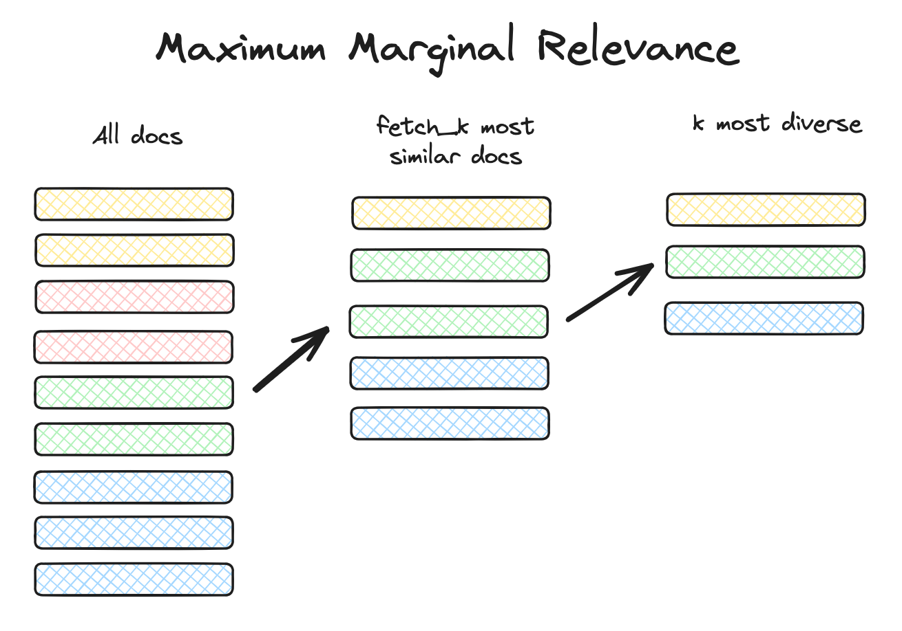
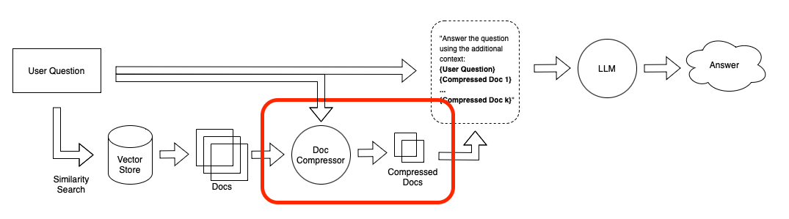

# Retrieval

## What is Retrieval ?

- Retrieval: given a user input, relevant splits are retrieved from storage using a [Retriever](https://python.langchain.com/v0.2/docs/concepts/#retrievers).
- Retrieval is the centerpiece of our retrieval augmented generation (RAG) flow.
- There are couples of methods to perform the retrieval:
  - Basic Semantic Similarity
  - Maximum Marginal Relevance (MMR)
  - SelfQuery: filter by metadata

## Addressing _Diversity_

- Problem with similarity search: how to enforce diversity (i.e will not retrieve duplicated content) in the search results.

### Selecting by Maximum Marginal Relevance (MMR)

- Maximum marginal relevance (MMR) strives to achieve both **relevance to the query** and **diversity** among the results.
- **MMR** is a combination of which examples are most similar to the inputs, while also optimizing for diversity. It does this by finding the examples with the embeddings that have the greatest cosine similarity with the inputs, and then iteratively adding them while penalizing them for closeness to already selected examples.
- MMR algorithm:
  - Query the vector store
  - Choose `fetch_k` most similar responses
  - Within those responses choose the `k` most diverse

<p align="center"><br></p>

```Python
vector_db.max_marginal_relevance_search(input_question, k=2, fetch_k=3)
```

## Addressing _Specificity_

- Problem 1: we have a question ask specifically about the lecture 3 content. However, the similarity search returns content from other lectures such as 1,2, and 4 as well.
- To address this, many vectorstores support operations on `metadata`.
  - `metadata` provides context for each embedded chunk.
- Problem 2: when you ingest data into your document storage system, you often don’t know what specific queries will be used to retrieve those documents.
  - When we get a specific user question and retrieve a document, even if the document has some relevant text it likely has some irrelevant text as well.
  - Inserting irrelevant information into the LLM prompt is bad because:
    - It might distract the LLM from the relevant information
    - It takes up precious space that could be used to insert other relevant information.

### Working with _metadata_ using `Self-Query` retriever

- `Self-Query` helps to infer the metadata from the query itself, which uses an LLM to extract:
  - The `query` string to use for vector search
  - A metadata filter to pass in as well
- Most vector databases support metadata filters, so this does not require any new databases or indexes.

```Python
from langchain.llms import OpenAI
from langchain.retrievers.self_query.base import SelfQueryRetriever
from langchain.chains.query_constructor.base import AttributeInfo

metadata_field_info = [
    AttributeInfo(
        name="source",
        description="The lecture the chunk is from, should be one of `docs/cs229_lectures/MachineLearning-Lecture01.pdf`, `docs/cs229_lectures/MachineLearning-Lecture02.pdf`, or `docs/cs229_lectures/MachineLearning-Lecture03.pdf`",
        type="string",
    ),
    AttributeInfo(
        name="page",
        description="The page from the lecture",
        type="integer",
    ),
]

document_content_description = "Lecture notes"
# llm is required to infer the metadata from the question
llm = OpenAI(model='gpt-3.5-turbo-instruct', temperature=0)
# init the Self Query Retriever with an LLM, vectordb and metadata field info
retriever = SelfQueryRetriever.from_llm(
    llm,
    vectordb,
    document_content_description,
    metadata_field_info,
    verbose=True
)

```

### Contextual Compression

- The idea is simple: instead of immediately returning retrieved documents as-is, we can compress them using the context of the given query so that only the relevant information is returned.
- “Compressing” here refers to both compressing the contents of an individual document and filtering out documents wholesale.

<p align="center"></p>

```Python
# ContextualCompressionRetriever
from langchain.retrievers import ContextualCompressionRetriever
from langchain.retrievers.document_compressors import LLMChainExtractor

# create llm to serve as the contextual compressor
llm = OpenAI(temperature=0, model="gpt-3.5-turbo-instruct")
compressor = LLMChainExtractor.from_llm(llm)

compression_retriever = ContextualCompressionRetriever(
    base_compressor=compressor,
    base_retriever=vectordb.as_retriever(search_type = "mmr") # mmr: this to prevent the duplicate contents (or ensure the diversity)
)
question = "what did they say about matlab?"
compressed_docs = compression_retriever.get_relevant_documents(question)

def pretty_print_docs(docs):
    print(f"\n{'-' * 100}\n".join([f"Document {i+1}:\n\n" + d.page_content for i, d in enumerate(docs)]))

pretty_print_docs(compressed_docs)
```
